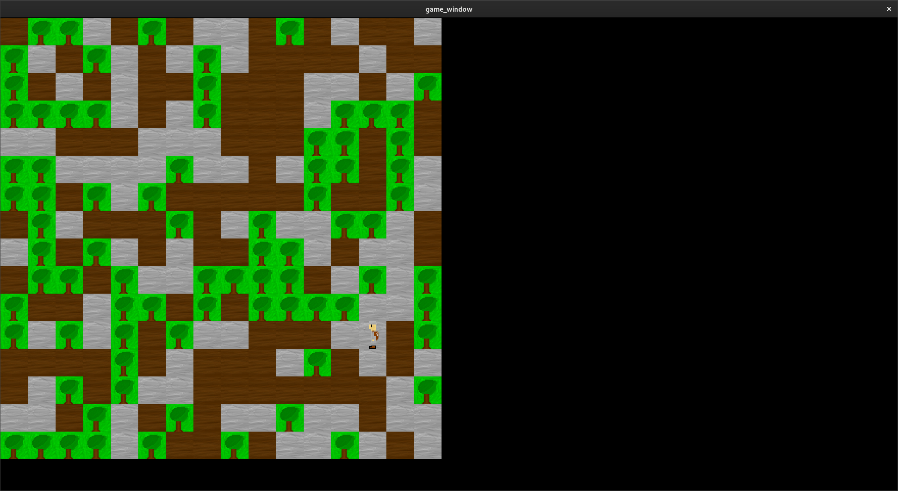
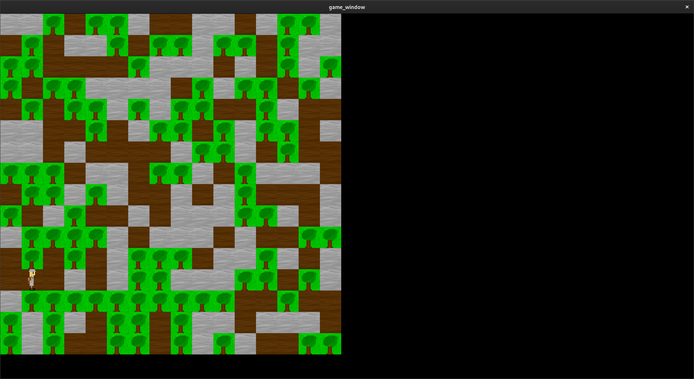
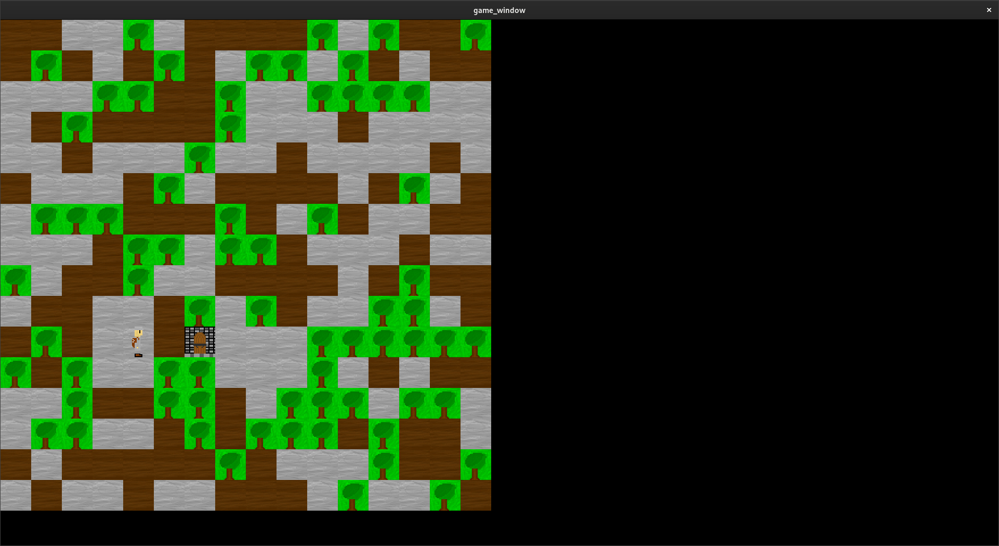
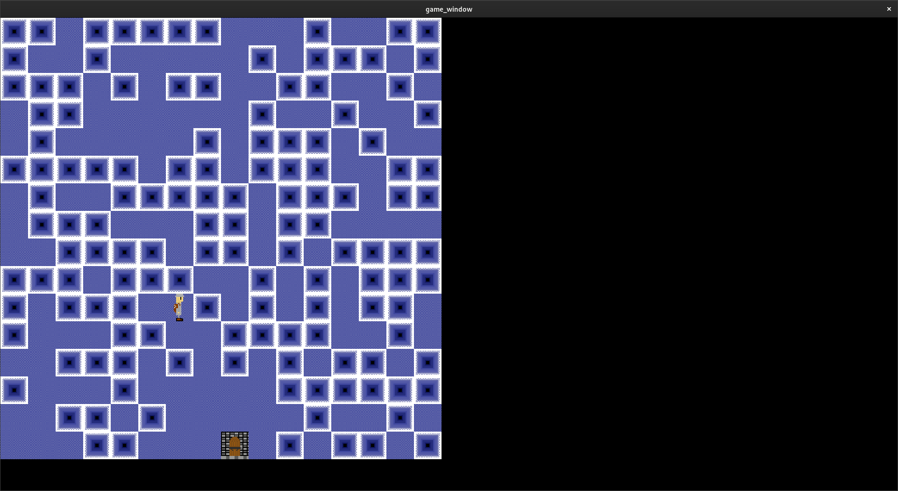
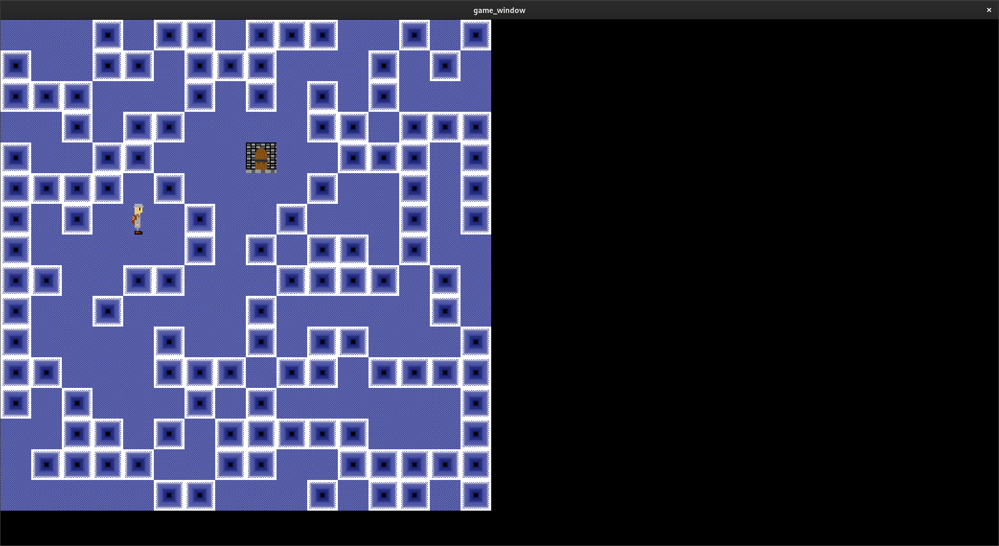
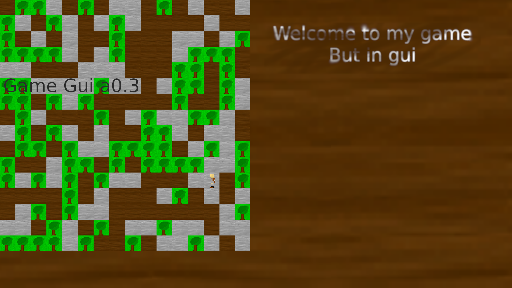

# Game_gui 
###### inside name: game_new
This is a game made with sdl2 and c++
it has (almost) infinite worlds, with 3 types of terrain, stone ground, dirt ground, and tree. In the future there will be propobly a lot more!

### IMPORTANT: New update with dungeons, could get you stuck. I have idea for next update, where dungeons have more sense and can's get you stuck (propobly), if you have any world you are proud of, you should download this version in other directory and play there! Also, dungeons WON'T appear on old chunks.

This is still early stage (alpha/beta)

also, I'm not trying to make this game windows, or mac compatible (focusing on linux, and the game itself for now)

screenshots / art:

