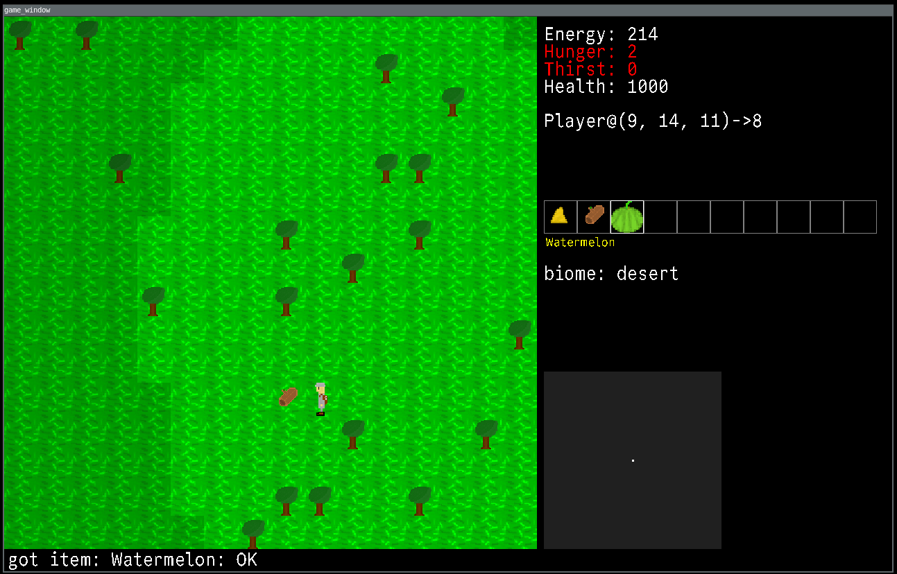

# Game\_gui (Pime - Piotr game)

This is a game made with sdl2 and C++. On master branch there is version for Godot.

### This project uses nerd-font: https://github.com/ryanoasis/nerd-fonts

## ALPHA STAGE: done

## BETA STAGE

### Requirements for Beta stage:
- [x] help menu in game
- [x] dungeons fix (better generation)
- [ ] in-game music - wip. artist needs more time
- [x] in-game "timer" (for in game events)
- [x] more distro support
- [x] Better generation
    - [x] More terrain types
        - [x] Water, with collision
    - [x] biome support
- [ ] Godot port
- [ ] Dropping items
- [ ] Change item backend
#### (this list will be longer)

## Installation

* [Installation instruction](install.md)

## Build

* [Build instruction](build.md)

## Keys

* ESC - menu: exit, load, save, help menu
* m   - menu: energy
* arrows, w, a, s, d - moves
* ctrl - run
* shift - sneak
* e, ENTER - interact / pickup item
* F5 - autoexplorer
* F11 - stop automaticaly resizing (may break some things)
* 1, 2, 3, 4, 5, 6, 7, 8, 9, 0 - select hotbar
* ` - previous hotbar
* TAB - next hotbar
* = - use from hotbar

